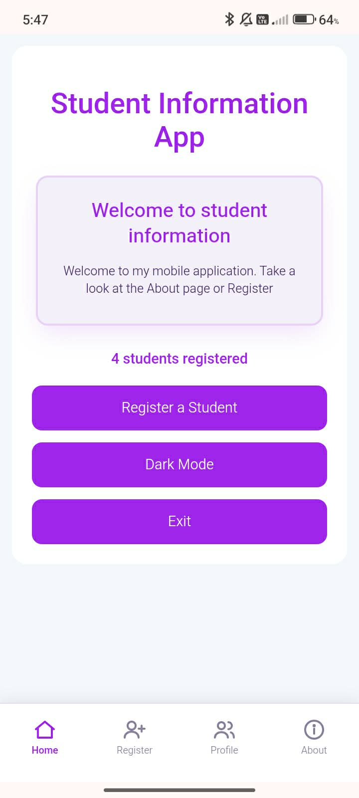

# Student Information App

A simple Android app for registering and managing student records, built with Apache Cordova using plain HTML, CSS, and JavaScript. Everything is saved on the device, so it works offline

**Download:** [app-debug.apk](https://github.com/Tristantzy/student-info-app/releases/latest)



## Features

- **Register students** with name, student ID, course, year level, email, and contact number
- **Pick, don't type:** course from a dropdown (with an "Other" option) and year level from tap buttons
- **Validation** with red borders on invalid fields and short toast messages
- **No duplicate student IDs**
- **Profile list** with search by name, ID, or course
- **Filter by year level** and **sort** by name, year, or newest
- **Edit and delete** records (delete asks for confirmation)
- **Student cards** with an initials avatar and a colored year badge
- **Bottom navigation bar** (Home, Register, Profile, About)
- **Dark mode** that is remembered between launches.
- **Student count** on the home page and the profile list.

## Built with

- HTML, CSS, and JavaScript (no frameworks)
- [Apache Cordova](https://cordova.apache.org/) for the Android build
- `localStorage` for saving data on the device

## Getting started

### What you need

- [Node.js](https://nodejs.org/)
- Cordova: `npm install -g cordova`
- [Android Studio](https://developer.android.com/studio) with the Android SDK, and a JDK (see the [Cordova Android requirements](https://cordova.apache.org/docs/en/latest/guide/platforms/android/))

You can check your setup with `cordova requirements`.

### Run it

```bash
git clone https://github.com/Tristantzy/student-info-app.git
cd student-info-app
npm install
cordova platform add android
cordova build android
```

The debug APK ends up in:

```
platforms/android/app/build/outputs/apk/debug/app-debug.apk
```

Copy it to your phone and open it to install. To install straight from your computer, turn on USB debugging on your phone, plug it in, and run:

```bash
cordova run android
```

### Quick look in a browser

Open `www/index.html` in your browser. The layout and features work, and the only thing missing is the Cordova features, so you'll see a harmless error for `cordova.js` in the console.

## Project structure

```
├── config.xml        # Cordova app settings (name, id, etc.)
├── package.json
└── www/
    ├── index.html    # Pages and navigation
    ├── css/index.css # Styles, including dark mode
    └── js/index.js   # App logic: forms, validation, storage, search
```

## Notes

- All data is stored in the app's `localStorage` on the device. Nothing is sent anywhere, and clearing the app's data or uninstalling it removes the records.
- The course list is in `www/index.html`. Edit the `<option>` lines to match your school's programs.

## Author

Tristan ([@Tristantzy](https://github.com/Tristantzy))
